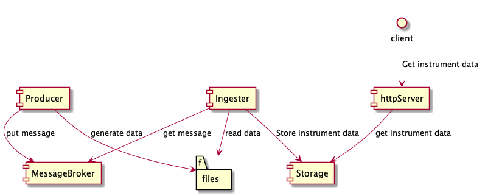

# instrument-pricing
Tracks price of instrument

## Solution
In this solution, I have assumed that the producer will put a message in a message-broker (say SQS). The message would 
 contain the number of records that are supposed to be produced so that the consumer knows when to stop.
 
 To prevent a consumer from waiting infinitely, there is a timeout for each thread. Value of timeout is configurable in `application.properties` file.
 
 We can invoke `/produce` end point which will generate a random number of files in a temporary directory. Once production is
 done, producer will put a message containing the folder path and the number of files to be generated.
 
 The consumer would keep pinging the messagebroker every 50ms and ask for a new message. Once a message is received, the 
 consumer will list all files in the directory and upload the instrument data in an In-Memory data store.
 
 ## Design
 
 Please check out the `intractions.puml`  or (a plant uml plugin would be required) `interactions.png` diagram for easy understanding of how different components are interacting. 
 
 
 
 ## Live demo steps
 ```bash
 # Build the jar and ru
mvn clean install && java -jar target/instrument-0.0.1-SNAPSHOT.jar

# Randomly produce some data.
curl -X POST http://localhost:8080/produce

#output
2019-05-29 17:01:48.609  INFO 23656 --- [nio-8080-exec-7] c.p.i.p.i.producer.ProducerService       : Instrument produced - id: ff5ec05b-0cd9-4526-b481-bbba6d019c16, price: 0.97224617, asOf: 1559142108609
2019-05-29 17:01:48.610  INFO 23656 --- [nio-8080-exec-7] c.p.i.p.i.producer.ProducerService       : Instrument produced - id: cf81c366-dabd-4033-adc4-50950cea0dfc, price: 0.26686972, asOf: 1559142108610
2019-05-29 17:01:48.610  INFO 23656 --- [nio-8080-exec-7] c.p.i.p.i.producer.ProducerService       : Instrument produced - id: 66606df1-d10a-4f6d-b830-4d3759304d54, price: 0.28685343, asOf: 1559142108610
2019-05-29 17:01:48.648  INFO 23656 --- [pool-2-thread-1] c.p.i.p.i.c.InstrumentDataProcessor      : Consumer task started ConsumerMessage(folderPath=/var/folders/8s/6ws698jd7q3f68fxcwnlnl5w0000gq/T/java:7598259827241401991, totalFiles=87)
2019-05-29 17:01:48.649  INFO 23656 --- [pool-2-thread-1] c.p.i.p.i.c.InstrumentDataProcessor      : files  87
2019-05-29 17:01:48.665  INFO 23656 --- [pool-2-thread-1] c.p.i.p.i.c.InstrumentDataProcessor      : files completed 0
2019-05-29 17:01:48.665  INFO 23656 --- [pool-2-thread-1] c.p.i.p.i.c.InstrumentDataProcessor      : All data consumed  87

# See all instrument ids present
curl  http://localhost:8080/instruments

# See price of an instrument
curl  http://localhost:8080/instrument/<<Instrumentid>>
```

## Things not done
 - Update of the price of an instrument.
 - clean up of temporary directory created by producer
 - Error handling on end points to return meaningful messages.
 - Logging is not configured
 